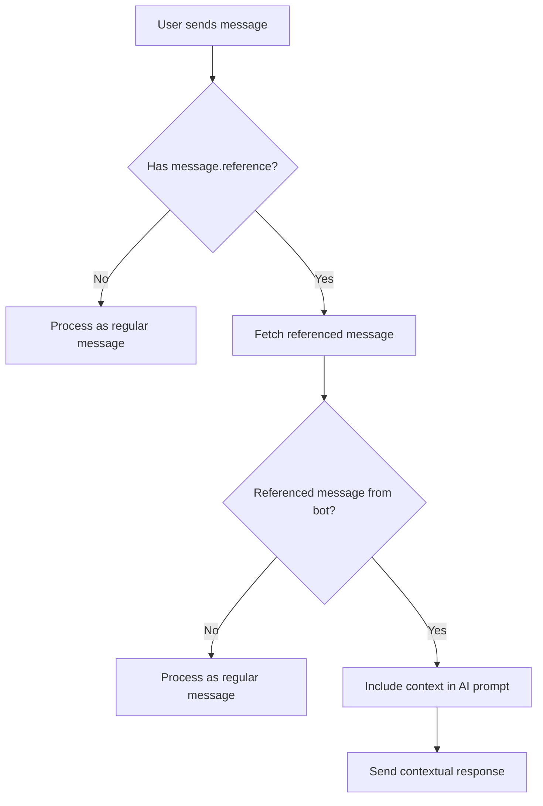

# Discord Reply Context Implementation Guide

## Overview

This document outlines how to implement reply context handling in the Discord bot to enable conversational continuity when users reply to bot messages.

## Current Implementation Analysis

The current Discord bot implementation processes messages in isolation without considering reply context:

### Current Code Flow
```javascript
// src/bot/discord-bot.ts - handleMentionMessage method
private async handleMentionMessage(message: any) {
  const question = message.content.replace(/<@!?\d+>/g, "").trim();
  const response = await this.aiService.generateResponse(question);
  // Sends reply without any context of previous messages
  await message.reply(response);
}
```

### Limitations
- ❌ No detection of reply messages
- ❌ No access to previous bot responses
- ❌ Each message processed in isolation
- ❌ No conversational continuity

## Discord.js Reply Context Properties

According to Discord.js documentation, reply context is available through:

### Key Properties
- `message.reference` - Contains reference data if message is a reply
- `message.reference.messageId` - ID of the message being replied to
- `message.channel.messages.fetch(messageId)` - Method to fetch referenced message

### Reply Detection Flow


## Implementation Plan

### Step 1: Modify handleMentionMessage Method

```typescript
private async handleMentionMessage(message: any) {
  try {
    let context = "";
    
    // Check if this is a reply to a bot message
    if (message.reference && message.reference.messageId) {
      try {
        const referencedMessage = await message.channel.messages.fetch(message.reference.messageId);
        if (referencedMessage.author.id === this.client.user.id) {
          context = `Previous bot response: "${referencedMessage.content}"\n\n`;
        }
      } catch (error) {
        console.error("Could not fetch referenced message:", error);
      }
    }
    
    const question = message.content.replace(/<@!?\d+>/g, "").trim();
    const fullPrompt = context + question;
    const response = await this.aiService.generateResponse(fullPrompt);
    
    const chunks = this.splitMessage(response);
    await message.reply(chunks[0]);
    
    for (let i = 1; i < chunks.length; i++) {
      await message.channel.send(chunks[i]);
    }
  } catch (error) {
    console.error("Error handling mention message:", error);
    await message.reply(
      "Sorry, I encountered an error. Please try again later.",
    );
  }
}
```

### Step 2: Enhanced Context Building

For better conversational context, consider implementing:

```typescript
private buildReplyContext(referencedMessage: Message): string {
  const timestamp = referencedMessage.createdAt.toLocaleString();
  return `Previous conversation (${timestamp}):\nBot: "${referencedMessage.content}"\n\nUser is replying to this message.\n\n`;
}
```

### Step 3: Context Window Management

To prevent context from growing too large:

```typescript
private truncateContext(context: string, maxLength: number = 500): string {
  if (context.length <= maxLength) return context;
  return context.substring(0, maxLength - 3) + "...";
}
```

## Benefits of Implementation

### ✅ Advantages
- **Natural Conversations**: Users can reply to bot messages contextually
- **Better UX**: Feels like talking to an intelligent assistant
- **Context Awareness**: Bot understands what it previously said
- **Follow-up Questions**: Users can ask clarifying questions about previous responses

### ⚠️ Considerations
- **API Rate Limits**: Additional fetch calls for referenced messages
- **Error Handling**: Need robust handling for deleted/ inaccessible messages
- **Context Length**: Must manage context to avoid exceeding AI token limits
- **Memory**: No persistent conversation history across restarts

## Testing Scenarios

### Test Cases to Implement
1. **Simple Reply**: User replies to bot message with follow-up question
2. **Cross-Reply**: User replies to another user's message mentioning the bot
3. **Deleted Reference**: User replies to a deleted bot message
4. **Long Context**: User replies to a very long bot message
5. **Multiple Replies**: Chain of replies between user and bot

### Example Test Dialogue
```
User: @bot tell me about @glsswrksgg's latest project
Bot: Based on the tweets, @glsswrksgg's latest project appears to be the Kurosun Ninja framework...

User: [replies to bot message] tell me more about the ninja framework
Bot: [should understand context] The Kurosun Ninja framework mentioned in the previous response is...
```

## Implementation Priority

### High Priority
- Basic reply detection and context inclusion
- Error handling for missing/deleted referenced messages
- Context length management

### Medium Priority
- Enhanced context formatting with timestamps
- Conversation history tracking (optional)
- Context relevance scoring

### Low Priority
- Persistent conversation storage
- Context summarization for long conversations
- Multi-message context chaining

## Files to Modify

### Primary Files
- `src/bot/discord-bot.ts` - Update `handleMentionMessage` method

### Optional Enhancements
- `src/services/ai-service.ts` - Add context-aware prompt building
- `src/types/` - Add interfaces for reply context

## Migration Status

The main OpenAI to Cerebras migration is **complete**. This reply context feature is an **enhancement** that would improve user experience but is not required for basic functionality.

## Next Steps

1. Review this implementation plan
2. Decide on priority level for this feature
3. Implement basic reply detection if approved
4. Test with various reply scenarios
5. Consider additional context management features

## Code Examples

### Full Enhanced handleMentionMessage Method

```typescript
private async handleMentionMessage(message: any) {
  try {
    let context = "";
    
    // Check if this is a reply to a bot message
    if (message.reference && message.reference.messageId) {
      try {
        const referencedMessage = await message.channel.messages.fetch(message.reference.messageId);
        if (referencedMessage.author.id === this.client.user.id) {
          context = this.buildReplyContext(referencedMessage);
          context = this.truncateContext(context);
        }
      } catch (error) {
        console.error("Could not fetch referenced message:", error);
      }
    }
    
    const question = message.content.replace(/<@!?\d+>/g, "").trim();
    
    if (!question) {
      await message.reply(`Hi! Ask me anything about @${this.mainHandle}`);
      return;
    }

    const fullPrompt = context + question;
    const response = await this.aiService.generateResponse(fullPrompt);
    const chunks = this.splitMessage(response);

    await message.reply(chunks[0]);

    for (let i = 1; i < chunks.length; i++) {
      await message.channel.send(chunks[i]);
    }
  } catch (error) {
    console.error("Error handling mention message:", error);
    await message.reply(
      "Sorry, I encountered an error. Please try again later.",
    );
  }
}

private buildReplyContext(referencedMessage: Message): string {
  const timestamp = referencedMessage.createdAt.toLocaleString();
  return `Previous conversation (${timestamp}):\nBot: "${referencedMessage.content}"\n\nUser is replying to this message.\n\n`;
}

private truncateContext(context: string, maxLength: number = 500): string {
  if (context.length <= maxLength) return context;
  return context.substring(0, maxLength - 3) + "...";
}
```

### Error Handling Examples

```typescript
// Enhanced error handling for different scenarios
private async fetchReferencedMessage(message: any): Promise<Message | null> {
  if (!message.reference?.messageId) return null;
  
  try {
    const referencedMessage = await message.channel.messages.fetch(message.reference.messageId);
    return referencedMessage;
  } catch (error) {
    if (error.code === 10008) { // Unknown Message
      console.log("Referenced message was deleted");
    } else if (error.code === 50001) { // Missing Access
      console.log("Bot doesn't have permission to access referenced message");
    } else {
      console.error("Error fetching referenced message:", error);
    }
    return null;
  }
}